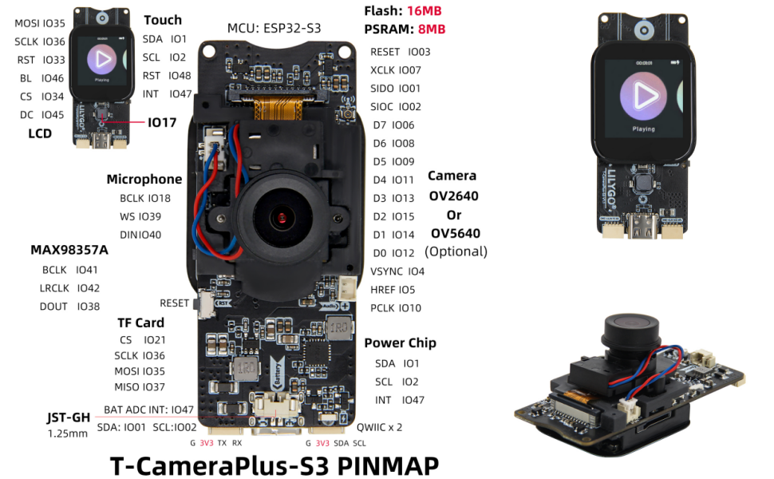

# NozzleCAM — ESP32-S3 T-Camera Plus v1.1

## 📌 Overview

**NozzleCAM** is a compact standalone MJPEG streaming camera based on the **LILYGO® T-Camera Plus S3 (v1.0–v1.1)** board.  
It combines the **ESP32-S3**, an **OV2640 2 MP camera sensor**, and a **1.3" 240×240 ST7789V TFT** display.



The device starts its own Wi-Fi access point, broadcasts a DNS wildcard (`http://nozzlecam/`) and mDNS (`http://nozzcam.local`), and hosts a responsive **web UI** for live streaming, snapshots, and local recording.

---

## ⚙️ Hardware

**Board:** T-Camera Plus S3 v1.0 / v1.1  
**MCU:** ESP32-S3 (8 MB PSRAM, 16 MB Flash)  
**Camera:** OV2640 (2MP)  
**Display:** ST7789V 1.3" 240×240 TFT (SPI)  
**Power:** USB-C 5 V

### 📸 OV2640 Camera Pinout (v1.1)

| Signal | ESP32-S3 GPIO |
|--------|--------------|
| RESET  | 3  |
| PWDN   | — (not connected) |
| XCLK   | 7  |
| SIOD   | 1  |
| SIOC   | 2  |
| VSYNC  | 4  |
| HREF   | 5  |
| PCLK   | 10 |
| D7..D0 | 6, 8, 9, 11, 13, 15, 14, 12 |

### 🖥️ ST7789V TFT Pinout

| Signal | ESP32-S3 GPIO |
|--------|--------------|
| MOSI   | 35 |
| SCLK   | 36 |
| CS     | 34 |
| DC     | 45 |
| RST    | 33 |
| BL     | 46 |

---

## 🧩 Features

- Wi-Fi SoftAP with captive DNS redirect  
- mDNS (`http://nozzcam.local`) and DNS wildcard (`http://nozzlecam/`)  
- MJPEG live stream at `/stream`  
- Single frame JPEG at `/jpg`  
- Health endpoint at `/health`  
- Camera reinit endpoint at `/reinit`  
- Web-based UI (`/`) with:
  - Live video preview
  - Snapshot capture (JPG download)
  - Local client-side video recording (WebM)
  - Fullscreen toggle
  - Settings page link (`/settings`)
- TFT splash screen shows SSID and IP on boot

---

## 🧰 Building and Flashing

### Prerequisites

- PlatformIO in VSCode
- USB-C cable

### platformio.ini

```ini
[platformio]
default_envs = t-camera-plus-s3

[env:t-camera-plus-s3]
platform = espressif32
board = esp32-s3-devkitc-1
framework = arduino

upload_speed = 921600
monitor_speed = 115200
board_build.partitions = huge_app.csv

build_flags =
  -D ARDUINO_USB_MODE=1
  -D ARDUINO_USB_CDC_ON_BOOT=1
  -D BOARD_HAS_PSRAM
  -mfix-esp32-psram-cache-issue
  -D CONFIG_LWIP_TCP_OVERSIZE_MSS=1

lib_deps =
  adafruit/Adafruit GFX Library
  adafruit/Adafruit ST7735 and ST7789 Library

```

⚠️ Some libraries (Arduino_GFX, lvgl) were tested but removed because of build issues on ESP32-S3; we use Adafruit_ST7789 now.

🚀 Usage
Flash firmware using PlatformIO

On boot the TFT shows:

SSID: T-CameraPlus

IP: 192.168.4.1

Connect to the Wi-Fi T-CameraPlus

Open a browser to:

http://192.168.4.1 (direct IP)

http://nozzlecam/ (DNS captive portal)

http://nozzcam.local (mDNS)

Use the top bar buttons to:

📸 Take snapshot

⏺ Start/stop recording

⛶ Toggle fullscreen

⚙️ Open /settings page

⚡ Known Issues & Challenges
📷 Camera init instability

OV2640 sometimes boots with SCCB bus stuck low. Implemented sccb_recover() to clock SCL manually.

Switching XCLK between 20 MHz and 24 MHz on init retries helps.

⚡ PSRAM vs DRAM allocation

Large frame buffers must go to PSRAM (CAMERA_FB_IN_PSRAM) to avoid heap exhaustion.

🖥️ ST7789 library compatibility

Arduino_GFX caused build errors (esp_rgb_panel_t undefined) on ESP32-S3.
→ Switched to Adafruit_ST7789 with explicit SPI.begin() pin mapping.

📶 Slow Wi-Fi startup

First AP start can take 3–5 seconds; TFT splash hides this delay.

🧪 Browser privacy modes

Client-side video recording may fail silently on strict browsers (DuckDuckGo, Safari private mode).

🛠️ Development Notes
HTML UI is stored in /src/www_index.h

Keeps it maintainable during development (no need to rebuild SPIFFS).

Edit and rebuild the sketch to update the web UI.

Settings page is served from /settings route

Plan: allow adjusting resolution, JPEG quality, brightness, contrast, auto exposure, gain, white balance.

📋 Roadmap
 Implement live adjustable camera settings via /settings

 Store settings persistently in NVS

 Optional STA mode with OTA updates

 Add FPS and heap usage overlay on stream

📜 License
GNU GENERAL PUBLIC LICENSE
Created by Arjen Gerritsen / Emergo IT - The Netherlands.

Based on:

ESP32 Arduino core

esp32-camera library

Adafruit_ST7789 / Adafruit_GFX

📎 References
[LILYGO® T-Camera Plus S3 product page](https://lilygo.cc/products/t-camera-plus-s3)  
[ESP32-S3 datasheet](https://github.com/Xinyuan-LilyGO/T-CameraPlus-S3)
